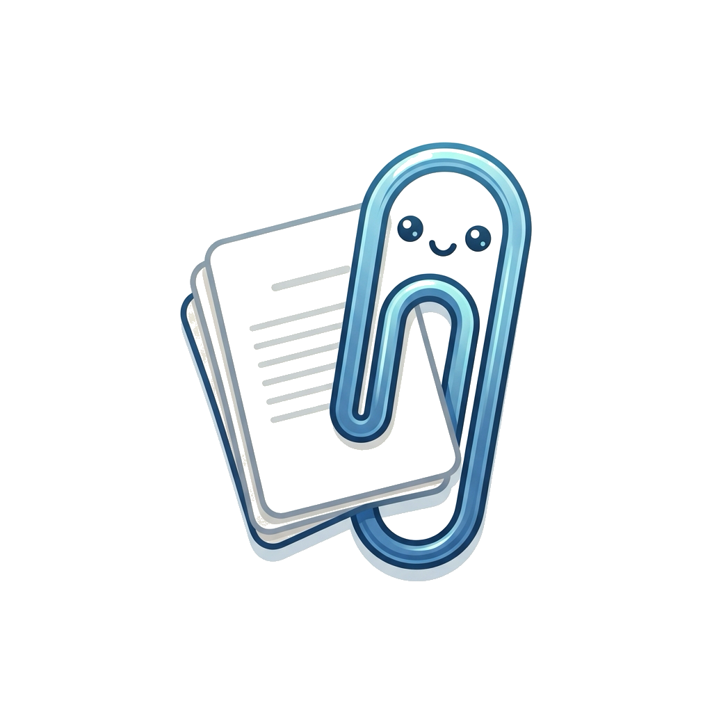
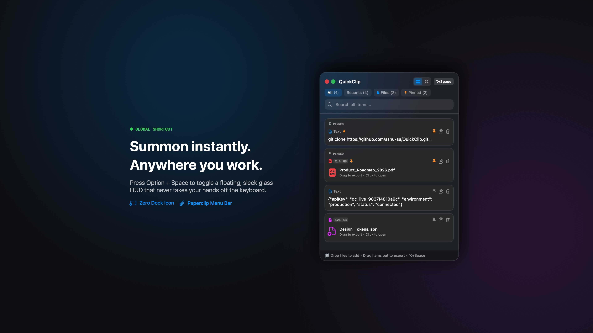
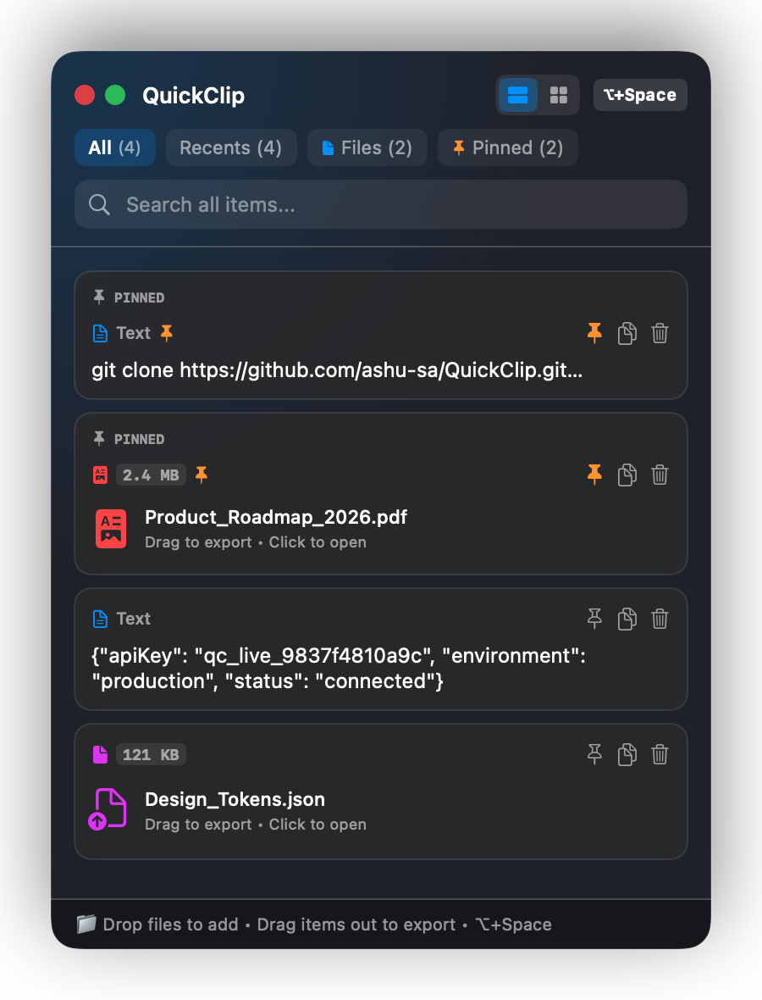
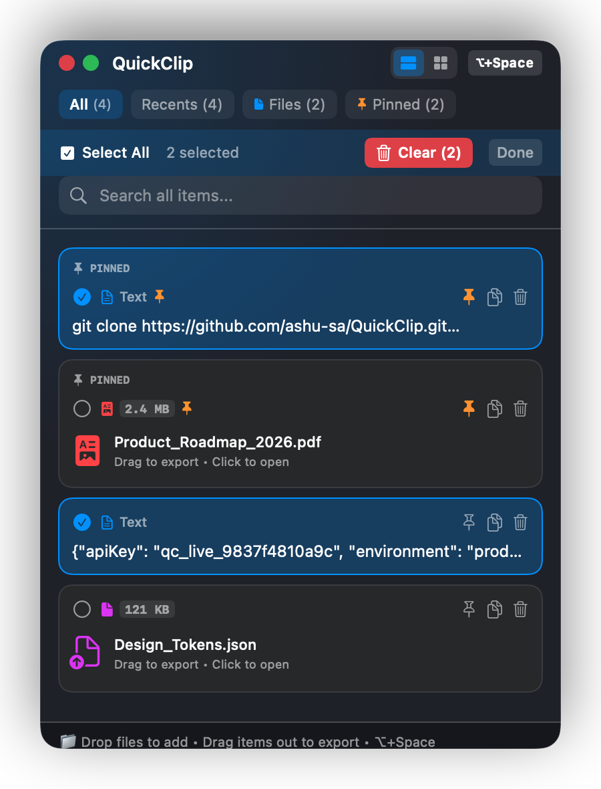

<div align="center">
  
  <h1>QuickClip for macOS</h1>
  <p><strong>A lightning-fast floating clipboard HUD & lightweight document stash for macOS.</strong></p>
  <p>
    <a href="https://github.com/ashu-sa/QuickClip/releases"></a>
    
    
    
  </p>
</div>

---

## 🎬 Launch Video (Generated with `/brag`)

Check out the launch teaser created directly from the codebase:

<div align="center">
  <a href="https://github.com/ashu-sa/QuickClip/releases/download/v1.0.0/QuickClip-Launch-Brag.mp4">
    
  </a>
  <p><em>Click the preview above or <a href="https://github.com/ashu-sa/QuickClip/releases/download/v1.0.0/QuickClip-Launch-Brag.mp4">download QuickClip-Launch-Brag.mp4</a> to watch the 18s high-res demo video.</em></p>
</div>

---

## ✨ Features

- ⚡️ **Global Shortcut (`⌥ + Space`)**: Summon or dismiss the floating HUD instantly from anywhere without touching your mouse or interrupting your flow.
- 🪟 **Floating Glass HUD**: Compact, non-activating floating panel (`LSUIElement`) with zero Dock presence. Lives unobtrusively in your Menu Bar.
- 📎 **Multi-Format Drag & Drop**: Drag copied text clips or screenshots directly into chat apps (Slack, Discord, WhatsApp), code editors, or browser inputs.
- 📁 **Lightweight Document Stash**: Drop files or PDFs up to 5MB directly into the window, or browse via macOS Finder.
- 📌 **Pin Favorites**: Keep your API keys, boilerplate code snippets, and essential documents pinned permanently at the top.
- 🛡 **Card-Tap Selection & Safe Delete**:
  - Click any card/snippet to activate selection mode.
  - Easily **Select All** or pick specific items.
  - Protected deletion with a confirmation prompt: *"Your paste data will be erased. Continue?"*
- 🎛 **Flexible Views**: Switch effortlessly between a compact vertical list or a 2-column grid layout.
- 🔍 **Instant Search**: Filter by text, file name, pinned items, or recent clips.

---

## 📸 Screenshots

<div align="center">
  <table>
    <tr>
      <td align="center"><strong>Floating HUD & History</strong></td>
      <td align="center"><strong>Card Selection & Safe Delete</strong></td>
    </tr>
    <tr>
      <td></td>
      <td></td>
    </tr>
  </table>
</div>

---

## 🚀 Installation & Download

### Option 1: Direct Download (Pre-built App)
Download the latest pre-compiled bundle from the [Releases Page](https://github.com/ashu-sa/QuickClip/releases):
1. Download `QuickClip-v1.0.0.zip`.
2. Unzip and drag `QuickClip.app` into your `/Applications` folder.
3. Open `QuickClip.app` and press `⌥ + Space` (Option + Space) to begin!

### Option 2: Build from Source
Requirements: macOS 12+ and Xcode Command Line Tools (`xcode-select --install`).

```bash
git clone https://github.com/ashu-sa/QuickClip.git
cd QuickClip
./build.sh
```

The script compiles the native Swift application, creates the `.app` bundle with high-resolution icons, and signs the binary.

---

## ⌨️ Shortcuts & Gestures

| Action | Shortcut / Gesture |
|---|---|
| **Toggle HUD** | `⌥ + Space` (Option + Space) |
| **Move Window** | Drag the top header or bottom drag footer |
| **Select Item** | Click any card |
| **Export Clip** | Click & drag card outward into any external app |
| **Add Files** | Drag & drop files onto HUD, or click `Browse` |
| **Exit Selection** | Click `Done` or deselect items |

---

## 📄 License

MIT License. Built with Swift and SwiftUI for macOS.
